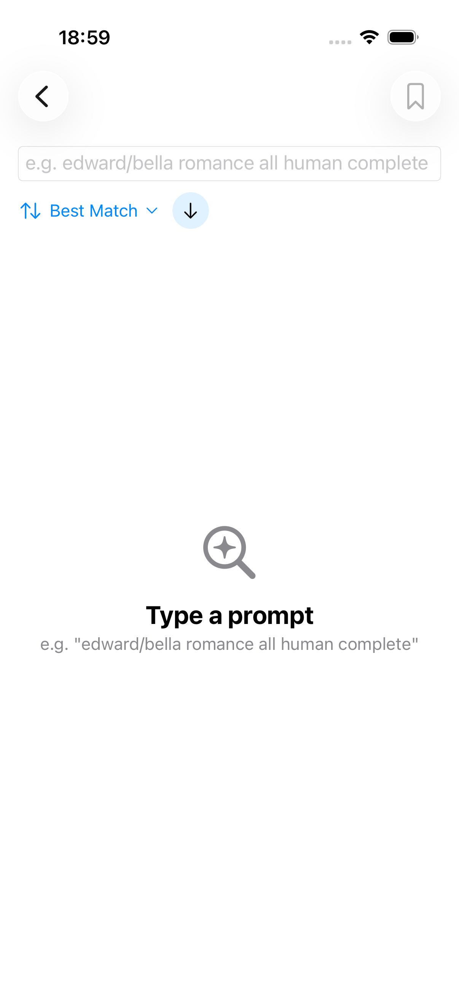
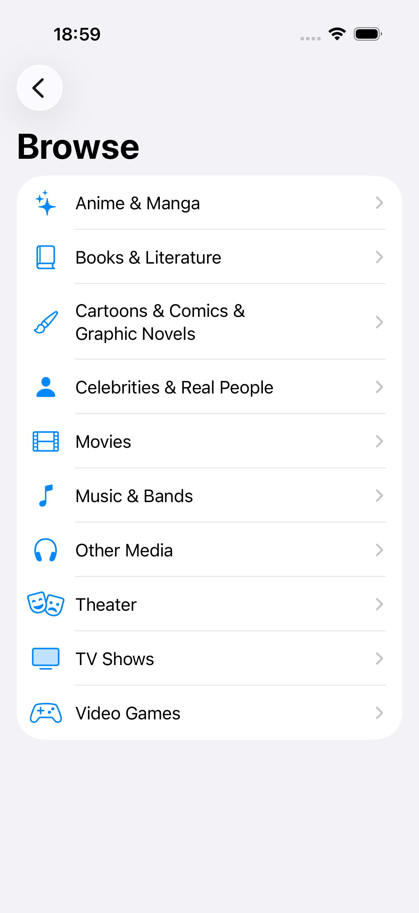
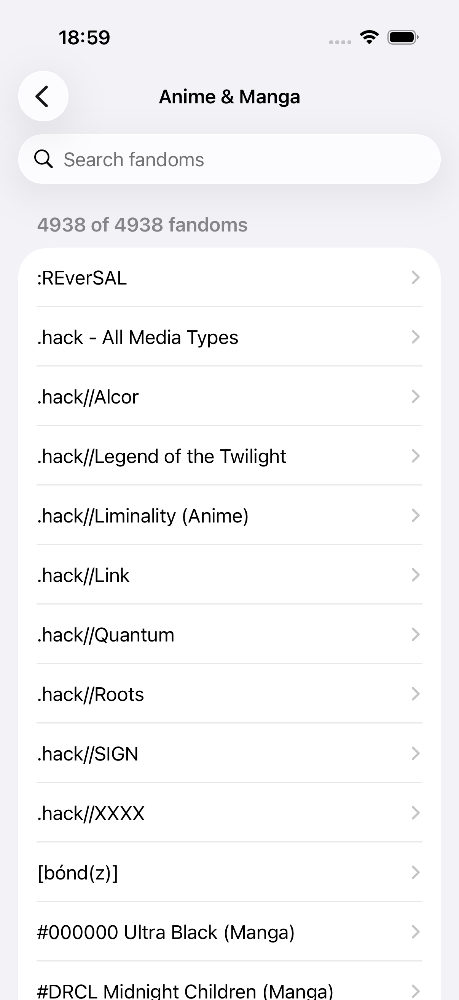
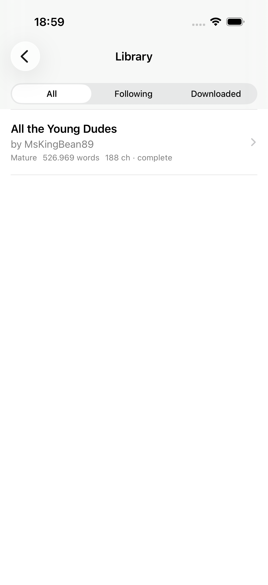
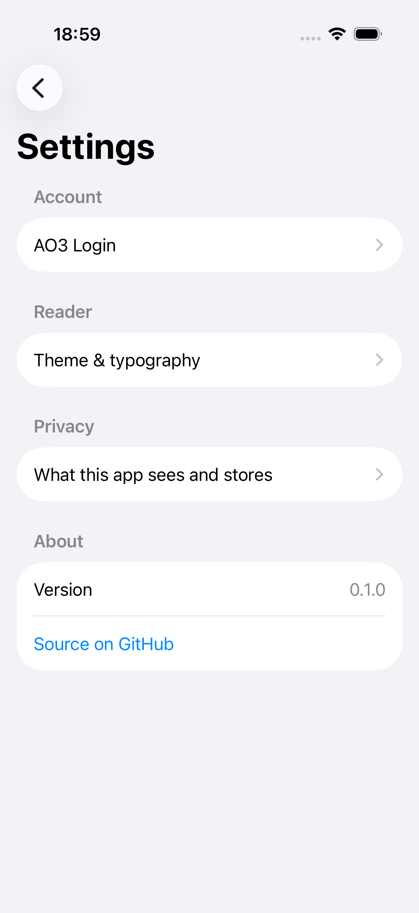
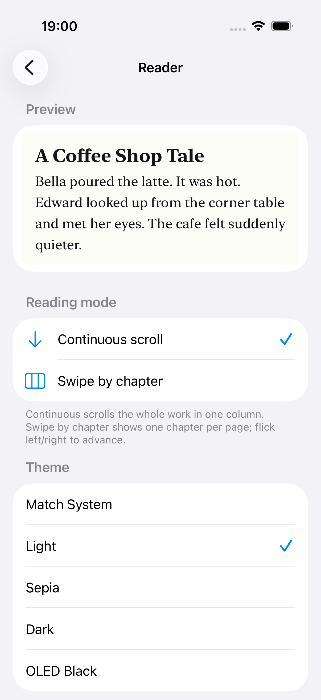

# Fanficly

An open-source, ad-free iPhone & iPad reader for [Archive of Our Own](https://archiveofourown.org).

<!-- screenshots:start -->
## Screenshots

<table>
<tr>
<td align="center"><br><sub>Smart prompt search</sub></td>
<td align="center"><br><sub>Browse by category</sub></td>
<td align="center"><br><sub>Every fandom, searchable</sub></td>
</tr>
<tr>
<td align="center"><br><sub>Library: follow &amp; download</sub></td>
<td align="center"><br><sub>Settings</sub></td>
<td align="center"><br><sub>Reader themes &amp; type</sub></td>
</tr>
</table>

_Regenerate with `bin/take-screenshots.sh`, or run the `ScreenshotTests` UI test which writes PNGs straight to `docs/screenshots/`._
<!-- screenshots:end -->

## Features

- **Smart prompt-style search** — type `draco/hermione enemies to lovers complete -angst` and it parses into proper AO3 filters (ships, characters, fandoms, ratings, warnings, categories, tags, word count, language, and `-`/`not` exclusions). Full AO3 sort options and pagination.
- **Browse by fandom** — all 10 AO3 media categories, each fetching the complete live fandom list (thousands per category) with instant substring search.
- **Reader** — continuous scroll or swipe-by-chapter, with a floating chapter indicator. Light / sepia / dark / OLED themes, five font families, six text sizes, four column widths — all persisted. Full work metadata (rating, warnings, relationships, characters, tags, stats) in the header.
- **Follow & save — no account needed** — bookmark any story to your device with one tap; followed works are polled in the background and you get a local notification when new chapters drop. Or download the EPUB for fully offline reading.
- **AO3 account (optional)** — log in to post kudos, subscribe on AO3, and sync your subscriptions. Credentials never stored; only the session cookie, in the Keychain.
- **Share to Kindle and anywhere else** — iOS share sheet hands off the EPUB directly.
- **iPad-native** — adaptive `NavigationSplitView` from day one.
- **Zero tracking** — no analytics, no crash reporters, no telemetry, no ads.

## Tech

- Swift 6, SwiftUI, SwiftData
- iOS 17+. The optional on-device smart-search enrichment uses Apple's Foundation Models framework, which requires iOS 26+ and an Apple-Intelligence-capable device; on everything else the rules-based parser handles search and the enricher is a no-op.
- [SwiftSoup](https://github.com/scinfu/SwiftSoup) for AO3 HTML parsing
- [KeychainAccess](https://github.com/kishikawakatsumi/KeychainAccess) for credential storage
- Project generated by [xcodegen](https://github.com/yonaskolb/XcodeGen) — `project.yml` is the source of truth

## Development

Set up:
```bash
brew install xcodegen
xcodegen generate
open Fanficly.xcodeproj
```

### Run locally in the simulator (no Xcode UI needed)

**One-time setup.** Point the command-line tools at full Xcode (not the
Command Line Tools shim — `simctl` only ships with full Xcode):
```bash
sudo xcode-select -s /Applications/Xcode.app/Contents/Developer
xcode-select -p   # should print /Applications/Xcode.app/Contents/Developer
```

If you skip this you'll get `xcrun: error: unable to find utility "simctl"`.

**Build and run:**
```bash
xcrun simctl boot "iPhone 17"
open -a Simulator

xcodebuild \
  -project Fanficly.xcodeproj -scheme Fanficly \
  -destination 'platform=iOS Simulator,name=iPhone 17' \
  -derivedDataPath build CODE_SIGNING_ALLOWED=NO build

xcrun simctl install booted \
  build/Build/Products/Debug-iphonesimulator/Fanficly.app
xcrun simctl launch booted io.github.yennster.fanficly
```

Rebuild after edits with the `xcodebuild build` + `simctl install` lines
(the simulator stays booted). To swap to iPad, replace `iPhone 17` with
`iPad Pro 13-inch (M5)` in both places.

**One-shot without changing `xcode-select`** (if you can't sudo):
```bash
export DEVELOPER_DIR=/Applications/Xcode.app/Contents/Developer
# then run the four commands above as-is
```
`xcrun` honours `DEVELOPER_DIR`, so `xcrun simctl …` will resolve to the
binary inside Xcode.app.

### Tests

```bash
xcodebuild test \
  -project Fanficly.xcodeproj \
  -scheme Fanficly \
  -destination 'platform=iOS Simulator,name=iPhone 17' \
  CODE_SIGNING_ALLOWED=NO \
  -only-testing:FanficlyTests
```

## About AO3

AO3 has no public JSON API; Fanficly works by parsing the same HTML pages the AO3 website serves. We're respectful guests:

- Identify ourselves in `User-Agent` (`Fanficly/<version> (+github.com/yennster/fanficly)`)
- Rate-limit ourselves to ≤1 request/second
- Cache aggressively
- Never parallelize scrapes
- Use the official `/downloads/` EPUB endpoints — no need to re-render works ourselves

Fanficly is not affiliated with AO3 or the Organization for Transformative Works.

## Privacy

We collect nothing. The app talks directly to AO3 from your device. Your AO3 session cookie lives in your iOS Keychain. Deleting the app erases everything. See [PRIVACY.md](PRIVACY.md).

## Contributing

PRs welcome — read [CONTRIBUTING.md](CONTRIBUTING.md) first. Be kind, be patient with reviewers. See [CODE_OF_CONDUCT.md](CODE_OF_CONDUCT.md).

## License

[MIT](LICENSE).
