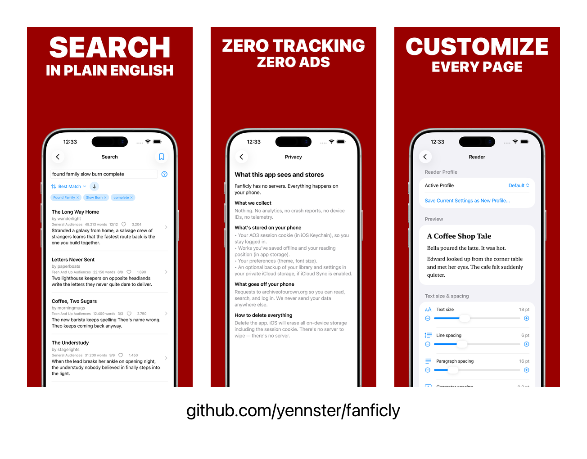

# Fanficly

An open-source, ad-free iPhone & iPad reader for [Archive of Our Own](https://archiveofourown.org).



_These are the App Store marketing screenshots. Regenerate with `bundle exec fastlane screenshots` (or `python3 bin/frame-screenshots.py` once the raw demo-mode shots exist): the `ScreenshotTests` UI test captures the raw screens to `docs/screenshots/{iphone,ipad}/`, then `bin/frame-screenshots.py` frames them in real Apple bezels via `fastlane frameit` and writes the finals to `screenshots/final/` and `fastlane/screenshots/en-US/`._

## Features

- **Smart prompt-style search** — type `draco/hermione enemies to lovers complete -angst` and it parses into proper AO3 filters (ships, characters, fandoms, ratings, warnings, categories, tags, word count, language, and `-`/`not` exclusions). Quote a phrase — `"Hermione Granger/Draco Malfoy"` — to pin an exact tag, pick several ratings at once, and use AO3's full sort options and pagination.
- **Browse by fandom, with AO3's full filter set** — all 10 AO3 media categories, each fetching the complete live fandom list (thousands per category) with instant substring search. A fandom's works can be filtered exactly like on AO3 (rating, warnings, category, completion, crossovers, word count, relationships/characters/tags include & exclude) — and typed tags resolve to AO3's canonical names via autocomplete, so `Hermione/Draco` finds `Hermione Granger/Draco Malfoy`. Save a filter preset once and reapply it to any fandom — or straight from the Browse home.
- **Reader** — continuous scroll, swipe-by-chapter, or horizontal page-by-page (Kindle-like) mode. Light / sepia / dark / OLED themes, five font families, six text sizes, line-spacing, paragraph-spacing, character-spacing (kerning), bold-text, and margin controls — all persisted and synced via iCloud. Full work metadata (rating, warnings, relationships, characters, tags, stats) in a collapsible header.
- **Resume where you left off** — your reading position (down to the paragraph) is saved automatically and restored when you reopen a story.
- **Follow, Star & Pin** — bookmark any story with one tap. Star stories you love, and pin important ones to the top of your library. Followed works are checked in the background with local notifications when new chapters drop.
- **Safari Share Sheet Integration** — add works to your library directly from mobile Safari or other browsers. Selecting the Fanficly action in the share sheet imports the work metadata and chapters instantly.
- **iCloud Library Sync** — automatically synchronize your library, reading positions, subscriptions, and preferences across devices using iCloud ubiquitous storage, with options to manually backup/restore or purge backups.
- **Export in any format** — share the work as EPUB, MOBI, AZW3 (Kindle), PDF, or HTML through the iOS share sheet (AirDrop, Send to Kindle, Books, Files, …).
- **AO3 account (optional)** — log in to subscribe on AO3, and sync your subscriptions. Credentials never stored; only the session cookie, in the Keychain.
- **iPad-native** — adaptive `NavigationSplitView` from day one.
- **Zero tracking** — no analytics, no crash reporters, no telemetry, no ads.

## Tech

- Swift 6, SwiftUI, SwiftData
- iOS 17+. The optional on-device smart-search enrichment uses Apple's Foundation Models framework, which requires iOS 26+ and an Apple-Intelligence-capable device; on everything else the rules-based parser handles search and the enricher is a no-op.
- [SwiftSoup](https://github.com/scinfu/SwiftSoup) for AO3 HTML parsing
- [KeychainAccess](https://github.com/kishikawakatsumi/KeychainAccess) for credential storage
- Project generated by [xcodegen](https://github.com/yonaskolb/XcodeGen) — `project.yml` is the source of truth

## Development

Set up:
```bash
brew install xcodegen
xcodegen generate
open Fanficly.xcodeproj
```

### Run locally in the simulator (no Xcode UI needed)

**One-time setup.** Point the command-line tools at full Xcode (not the
Command Line Tools shim — `simctl` only ships with full Xcode):
```bash
sudo xcode-select -s /Applications/Xcode.app/Contents/Developer
xcode-select -p   # should print /Applications/Xcode.app/Contents/Developer
```

If you skip this you'll get `xcrun: error: unable to find utility "simctl"`.

**Build and run:**
```bash
xcrun simctl boot "iPhone 17"
open -a Simulator

xcodebuild \
  -project Fanficly.xcodeproj -scheme Fanficly \
  -destination 'platform=iOS Simulator,name=iPhone 17' \
  -derivedDataPath build CODE_SIGNING_ALLOWED=NO build

xcrun simctl install booted \
  build/Build/Products/Debug-iphonesimulator/Fanficly.app
xcrun simctl launch booted io.github.yennster.fanficly
```

Rebuild after edits with the `xcodebuild build` + `simctl install` lines
(the simulator stays booted). To swap to iPad, replace `iPhone 17` with
`iPad Pro 13-inch (M5)` in both places.

**One-shot without changing `xcode-select`** (if you can't sudo):
```bash
export DEVELOPER_DIR=/Applications/Xcode.app/Contents/Developer
# then run the four commands above as-is
```
`xcrun` honours `DEVELOPER_DIR`, so `xcrun simctl …` will resolve to the
binary inside Xcode.app.

### Running on a physical device (code signing)

The simulator needs no signing. To run on a device, put your Apple
Developer **Team ID** in `Signing.xcconfig` (the project reads
`DEVELOPMENT_TEAM` from there), then keep that local edit out of git:

```bash
echo 'DEVELOPMENT_TEAM = ABCDE12345' > Signing.xcconfig   # your team ID
git update-index --skip-worktree Signing.xcconfig          # don't commit it
xcodegen generate
```

Find your Team ID in Xcode ▸ Settings ▸ Accounts, or at
developer.apple.com ▸ Membership. Make sure that Apple ID is signed into
Xcode so automatic signing can create a provisioning profile.

### Tests

```bash
xcodebuild test \
  -project Fanficly.xcodeproj \
  -scheme Fanficly \
  -destination 'platform=iOS Simulator,name=iPhone 17' \
  CODE_SIGNING_ALLOWED=NO \
  -only-testing:FanficlyTests
```

## About AO3

AO3 has no public JSON API; Fanficly works by parsing the same HTML pages the AO3 website serves. We're respectful guests:

- Identify ourselves in `User-Agent` (`Fanficly/<version> (+github.com/yennster/fanficly)`)
- Rate-limit ourselves to ≤1 request/second
- Cache aggressively
- Never parallelize scrapes
- Use the official `/downloads/` EPUB endpoints — no need to re-render works ourselves

Fanficly is not affiliated with AO3 or the Organization for Transformative Works.

## Privacy

We collect nothing. The app talks directly to AO3 from your device. Your AO3 session cookie lives in your iOS Keychain. Deleting the app erases everything. See [PRIVACY.md](PRIVACY.md).

## Contributing

PRs welcome — read [CONTRIBUTING.md](CONTRIBUTING.md) first. Be kind, be patient with reviewers. See [CODE_OF_CONDUCT.md](CODE_OF_CONDUCT.md).

## License

[PolyForm Noncommercial License 1.0.0](LICENSE).
